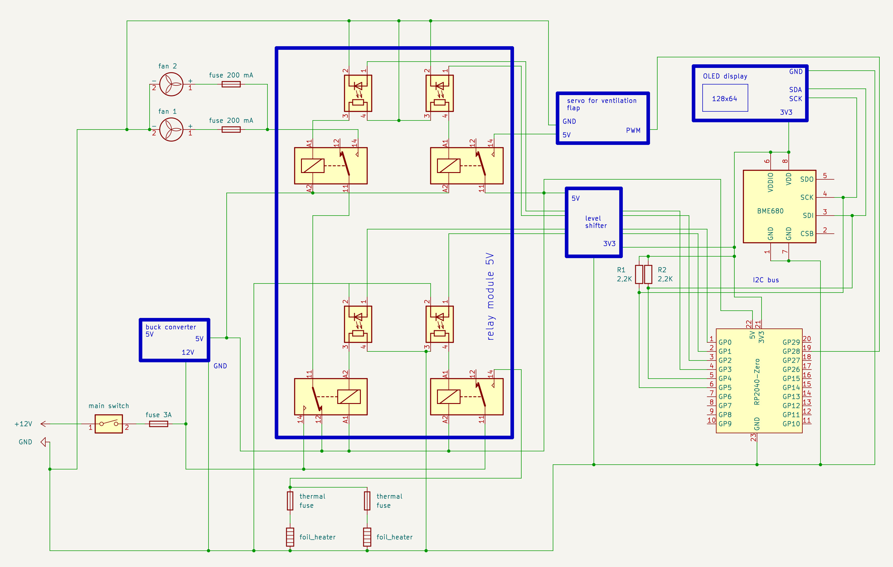

# ulisp-incubator
Firmware for DIY heating cabinet for sourdough and other fermentation processes

This is a small program written in uLisp controlling an automated incubator. It uses the following components that may easily be altered according to different needs:

- Waveshare RP2040 Zero
- Standard 4-channel relay board (low active)
- 4-channel level shifter
- BME680 heat and humidity sensor breakout (I2C)
- OLED display 128x64 with SH1106 controller (I2C)
- "Buck" module 12 V in, 5 V out, at least 3 A
- 2 computer fans (12 V)
- 2 foil heaters 12 V, 12 W
- 2 thermal fuses (e.g. 84 degrees Celsius)
- 1 miniature fuse 3 A (main power supply)
- 2 self-resetting fuses 150 or 200 mA (fans)
- main switch
- 12 V power supply, at least 3 A continuous power delivery
- micro servo for ventilation flap

The uLisp extension for the BME680 sensor, the servo and the OLED display uses the following Arduino libraries that need to be installed prior to compilation: *Adafruit BME680 library*, *Adafruit Unified Sensor*, *Servo*, *U8g2*.

